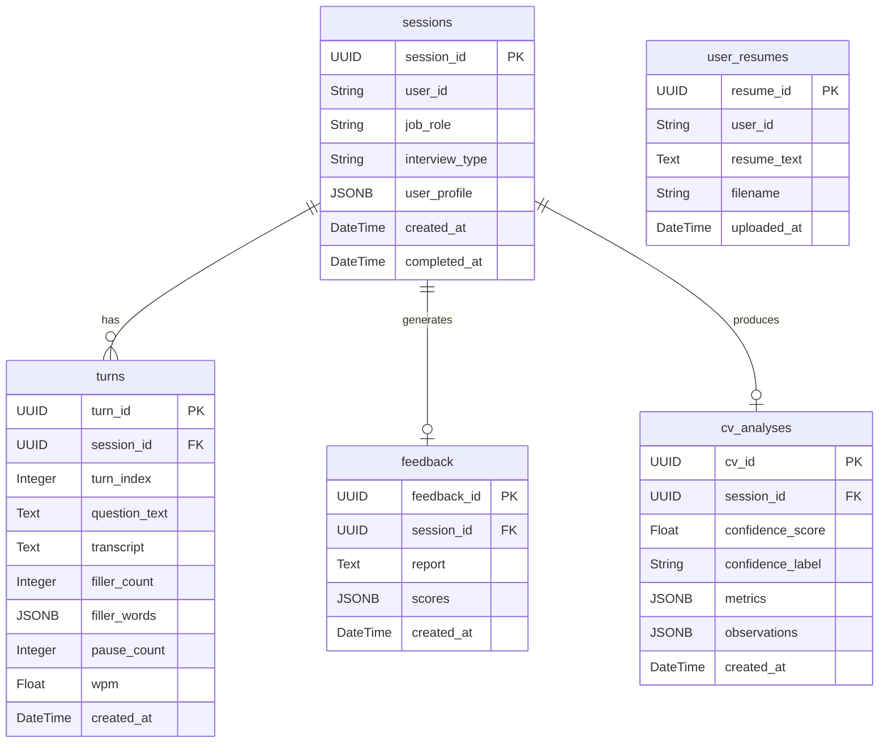

# Entity Relationship Diagram

> Active sessions live in an in-memory store during an interview. All data is persisted to Cloud SQL (PostgreSQL) in a single atomic commit when `POST /sessions/{id}/end` is called.

---

## Table Notes

### `sessions`
Root entity for a completed interview. `user_profile` (JSONB) stores experience level, communication challenges, and goals — passed directly into the Gemini feedback prompt. `completed_at` is null for in-flight sessions (which live only in the in-memory store).

### `turns`
One row per question–answer exchange. `filler_words` is a JSONB map of filler labels to occurrence counts (e.g. `{"um": 3, "like": 5}`). `wpm` is stored for reference but is **not** passed to the Gemini feedback prompt to avoid penalising speaking pace.

### `feedback`
One-to-one with `sessions`. `scores` (JSONB) holds the full score breakdown: `answer_relevance`, `experience_articulation`, `industry_fit`, `clarity_and_structure`, `filler_word_usage`, `eye_contact_and_presence` (optional — only present when video was recorded), and `overall`.

### `cv_analyses`
One-to-one with `sessions`. `metrics` (JSONB) stores the full `CVMetrics` object including the per-frame gaze timeline. `observations` is a JSONB array of human-readable coaching strings generated by the confidence scorer.

### `user_resumes`
Independent of the session graph. `user_id` is the Google OAuth `sub` claim stored as a plain string — there is no foreign key constraint, keeping resume storage intentionally decoupled from interview sessions.
