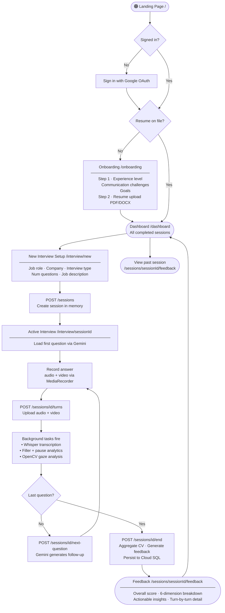

# User Flow Diagram

---

## Phase Summary

| Phase | Route | Key Events |
|---|---|---|
| Discovery | `/` | Features, FAQ, sign-in CTA |
| Authentication | Google OAuth | `sub` claim stored as `user_id` in JWT |
| Onboarding | `/onboarding` | Profile captured; resume uploaded and stored in `user_resumes` |
| Interview Setup | `/interview/new` | Session parameters collected; `POST /sessions` creates in-memory session |
| Active Interview | `/interview/[sessionId]` | `loading → ready → recording → processing → answered` (loops per question) → `ending → done` |
| Results | `/sessions/[sessionId]/feedback` | Scores, AI feedback, per-turn breakdown |
| History | `/dashboard` | All completed sessions listed as cards |

## Guards

- Unauthenticated users are redirected to `/` from any protected route via `frontend/src/proxy.ts`.
- Authenticated users without a resume are redirected to `/onboarding` from `/dashboard`.
- Raw audio and video are never persisted — processed in-memory and discarded after each turn.
